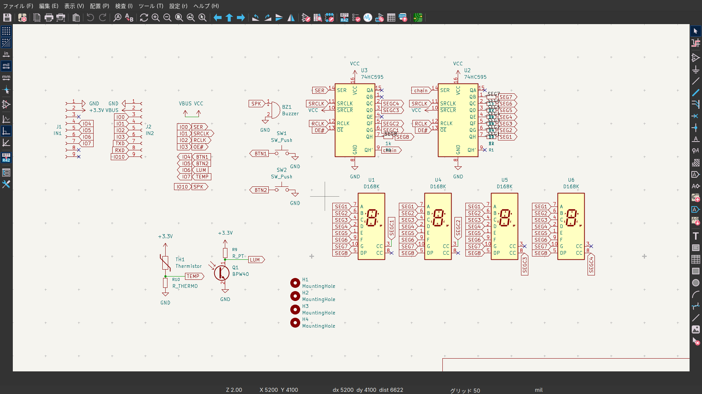
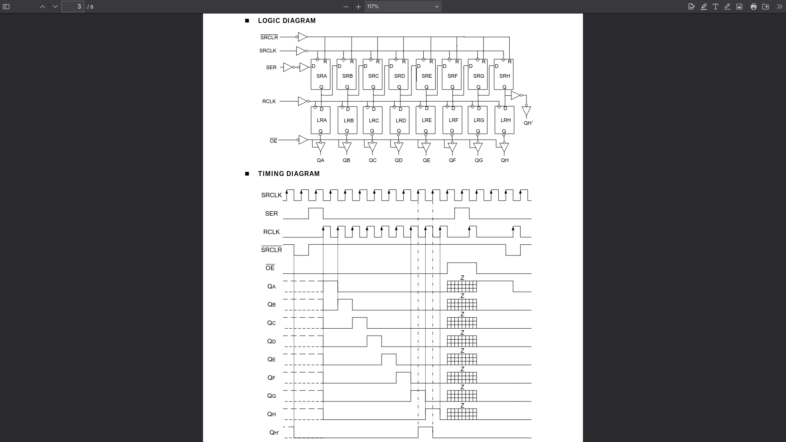
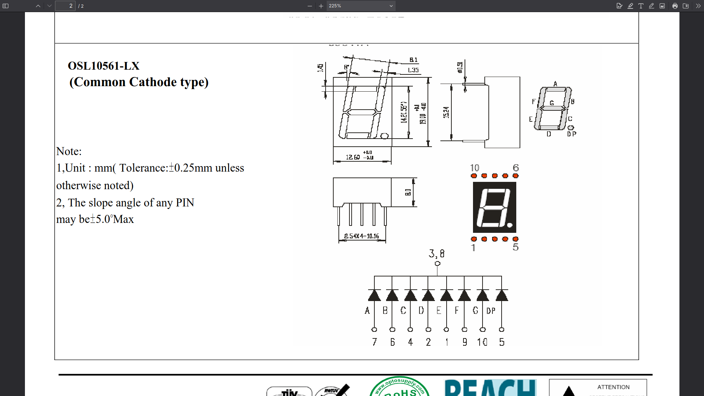

#!/bin/env -S marp -p

---

# ハードウェア講習 第3回

---

# index
- printデバッグ
- ボタンを読む
- センサを読む
- 7セグ

---

# printデバッグ
---
# printデバッグ
- ArduinoのSerialクラス
- USB経由で文字列等のデータを送受信できる
- 115200はbaudレート
    - 送受信両方の環境で合わせる必要がある
```cpp
void setup(){Serial.begin(115200);}
void loop(){Serial.printf("Hello %d\n",millis());}
```

- このサンプル書くと多分書き込みができなくなる
- `platformio.ini`に`upload_flags=--no-stub`を追加
    - 書き込みにブートローダを使わないオプション
---

# ボタンを読む
---
# ボタンを読む
- ボタンの両端をIO,GNDに結線してある
- IOにはVCCとの間に抵抗を挟んでおく機能がある(PULLUP)
    - ボタンが押されている
        - IO,GND間は0 ohm: IOはGNDと等電位
    - ボタンが押されていない
        - IO,GND間はInf ohm: IOはVCCと等電位
- PULLUP無しではIOが宙に浮いた状態 電位が定まらない
```cpp
void setup(){Serial.begin(115200);pinMode(4,INPUT_PULLUP);}
void loop(){Serial.printf("pin 4 = %d\n",!digitalRead(4));delay(100);}
```

---

# センサを読む
---
# センサを読む
- フォトトランジスタ
    - 明るいと電流を流す
    - 抵抗で電流を電圧に読み替える
- サーミスタ
    - 熱いと抵抗が大きくなる
    - 抵抗値をそのまま分圧に用いて電圧を得る
```cpp
void setup(){Serial.begin(115200);pinMode(6,INPUT);}
void loop(){Serial.printf("pin 6 = %d\n",analogRead(6));delay(100);}
```

---

# ESP32C3でdigitalReadに対応しているピンはIO 0~5 だけ
Q. IO6,7にセンサ類がついてますが?
A. みなさんもデータシートを読む癖を付けましょう
Q. 使えないってことですか?
A. ごめんなさい

---

# 7セグ
---
# 7セグ
- 74HC595
    - シフトレジスタ
- OSL10561-LW
    - 7セグ カソードコモン
---


---


---


---
- データの流れる方向 \>\>\> __43_21d _FEDCBA

```cpp
#define PIN_SER 0
#define PIN_SERCLK 1
#define PIN_RCLK 2
#define PIN_OE_ 3
void setup(){
	pinMode(PIN_SER,OUTPUT);digitalWrite(PIN_SER,HIGH);
	pinMode(PIN_SERCLK,OUTPUT);digitalWrite(PIN_SERCLK,HIGH);
	pinMode(PIN_RCLK,OUTPUT);digitalWrite(PIN_RCLK,HIGH);
	pinMode(PIN_OE_,OUTPUT);digitalWrite(PIN_OE_,LOW);
	analogWrite(PIN_OE_,200);

	shiftOut(PIN_SER,PIN_SERCLK,LSBFIRST,0b00111111);
	shiftOut(PIN_SER,PIN_SERCLK,LSBFIRST,0b00110101);
	digitalWrite(PIN_RCLK,LOW);digitalWrite(PIN_RCLK,HIGH);

}
void loop(){delay(100);}
```

---

- 同時に1種類の文字しか点灯できない
    - 人間の知覚できない速度で各桁毎に表示する => ダイナミック点灯
```cpp
void loop(){
    // 0.
	shiftOut(PIN_SER,PIN_SERCLK,LSBFIRST,0b00111111);
	shiftOut(PIN_SER,PIN_SERCLK,LSBFIRST,0b00110101);
	digitalWrite(PIN_RCLK,LOW);digitalWrite(PIN_RCLK,HIGH);
    // 1
	shiftOut(PIN_SER,PIN_SERCLK,LSBFIRST,0b00000110);
	shiftOut(PIN_SER,PIN_SERCLK,LSBFIRST,0b00110010);
	digitalWrite(PIN_RCLK,LOW);digitalWrite(PIN_RCLK,HIGH);
    // 2
	shiftOut(PIN_SER,PIN_SERCLK,LSBFIRST,0b01011011);
	shiftOut(PIN_SER,PIN_SERCLK,LSBFIRST,0b00100110);
	digitalWrite(PIN_RCLK,LOW);digitalWrite(PIN_RCLK,HIGH);
    // 3
	shiftOut(PIN_SER,PIN_SERCLK,LSBFIRST,0b01001111);
	shiftOut(PIN_SER,PIN_SERCLK,LSBFIRST,0b00010110);
	digitalWrite(PIN_RCLK,LOW);digitalWrite(PIN_RCLK,HIGH);
}
```

---

- 3がEになった
- 7セグを逆さにつける設計にしてある
- ソフトで逆さにする
- ABCDEFG をDEFABCG にする
